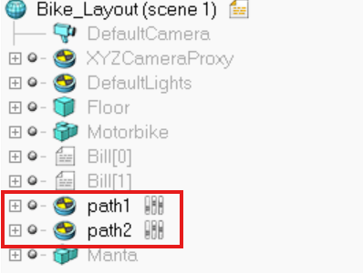

# AuE6930_F24_FinalProject
## Demo Video

Watch our agent in action: [YouTube Demo](https://youtu.be/ib-J4YWBM8U)

# Deep Deterministic Policy Gradient AI Agent for Vehicle Control

This repository contains the implementation of a Deep Deterministic Policy Gradient (DDPG) based AI agent for autonomous vehicle control using multi-channel occupancy grid representations. The system integrates a CoppeliaSim-based simulation environment with a custom reinforcement learning framework to train agents for path following and obstacle avoidance tasks.

## Features

- **Custom CoppeliaSim Bridge**: A robust interface between the RL environment and CoppeliaSim simulator. Paths are placed at the top level and named sequentially (path1, path2, path3, etc.) This allows simple loading of all path information in the python bridge.



- **Multi-Channel Occupancy Grid**: Novel 4-channel representation combining:
  - Binary obstacle information
  - Distance fields
  - Path information
  - Path deviation metrics


- **DDPG Implementation**: Complete with actor-critic networks, replay buffer, and various training optimizations


- **Dual-Stream Neural Network**: Architecture processing both spatial and dynamic vehicle state information


- **Multiple Reward Functions**: Implements simple, standard, and smooth reward schemes


## Project Structure

- `CoppeliaBridge/`: Interface between Python and CoppeliaSim
- `ReinformentLearning/`: Core RL implementation including:
  - `Buffer.py`: Replay buffer implementation
  - `Configs.py`: Configuration classes
  - `Environment.py`: RL environment wrapper
  - `NeuralNetworks.py`: Actor and critic network architectures
  - `RewardCalculator.py`: Reward function implementations
  - `RLAgent.py`: DDPG agent implementation
  - `TestAgent.py`: Testing utilities
  - `TrainAgent.py`: Training scripts
  - `VehicleHandler.py`: Vehicle state management

## Requirements

- Python packages:
  ```
  coppeliasim-zmqremoteapi-client
  scikit-learn
  scikit-image
  numpy
  torch
  matplotlib
  ```
- CoppeliaSim Simulator

## Setup and Installation

1. Install CoppeliaSim from the [official website](https://www.coppeliarobotics.com/)
2. Install required Python packages:
   ```bash
   pip install -r requirements.txt
   ```
3. Clone this repository:
   ```bash
   git clone https://github.com/cdauchess/AuE6930_F24_FinalProject.git
   ```
4. Have Coppelia Sim open with *Scenes/Qscene5.ttt* prior to running the python script
## Usage

### Training an Agent

```python
from TrainAgent import train_agent

# Train a new agent
train_agent(num_episodes=500)

# Continue training from existing model
train_agent(num_episodes=300, model_name="TrainedAgents/agent_trained07.pt")
```

### Testing an Agent

```python
from TestAgent import test_agent

test_agent("TrainedAgents/agent_trained08.pt", num_episodes=2)
```

## Results

Our best performing agent (Agent 12) achieved:
- Mean path error: 0.06m
- Mean speed: 1.43 m/s
- Successfully completed full episodes without collisions
- Smooth path following with effective obstacle avoidance

## Demo Video

Watch our agent in action: [YouTube Demo](https://youtu.be/ib-J4YWBM8U)

## Authors

- Kalpit Vadnerkar
- Charlie Dauchess
- Pranav Korrapati
